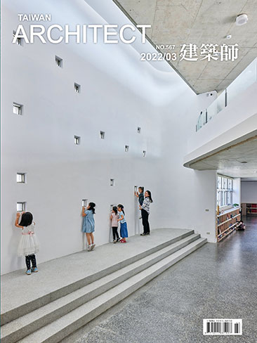

# [建築與科學 瑞士蘇黎世聯邦理工學院的數位建築實踐 Architecture and Science Digital Architecture in the Swiss Federal Institute of Technology Zurich](http://www.geneatcg.com/Kao_TaiwanArchitectMagazine_2022_03_Specialissue/)

> 台灣建築師雜誌 - 2022/03 - Special Issue, Page 112-115,
> 高鼎鈞

